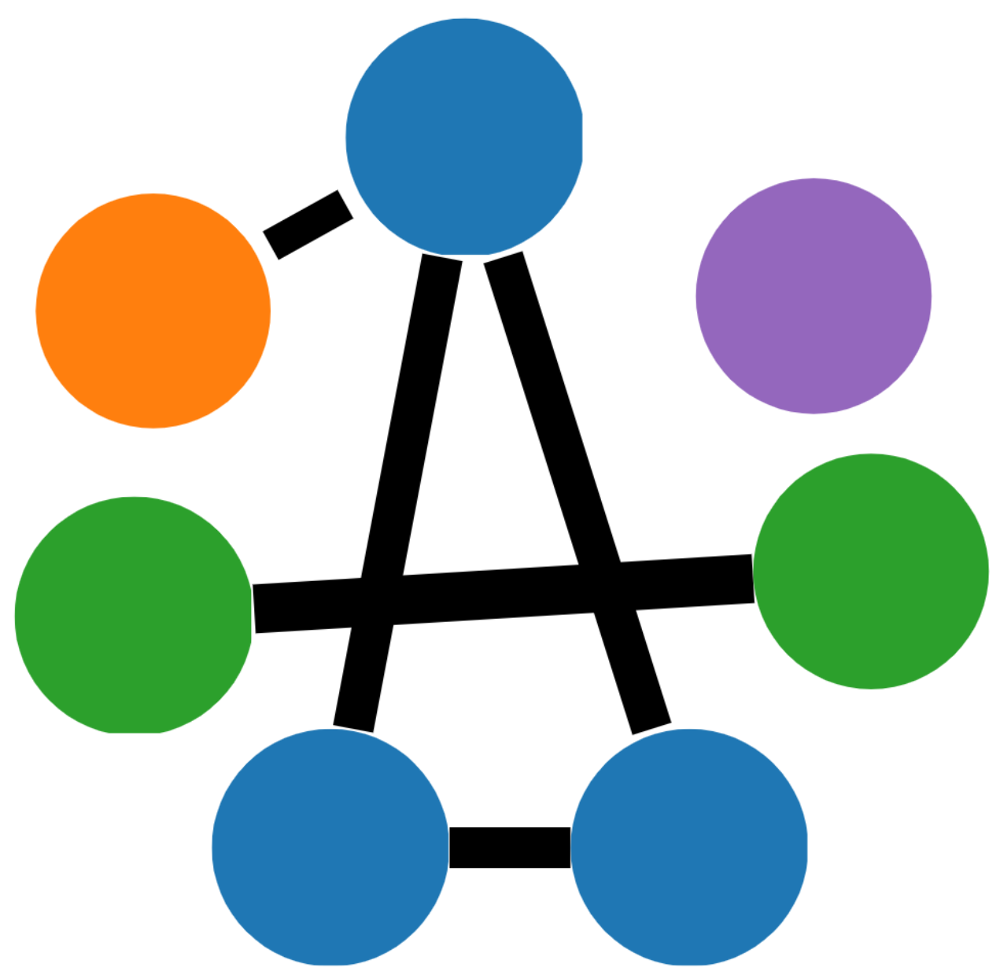
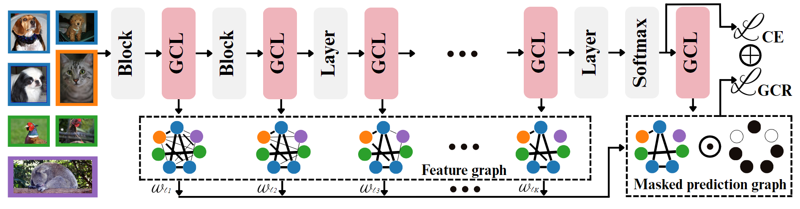

<div align="center">
  <h1 style="display: flex; align-items: center; justify-content: center; gap: 15px; margin: 0;">
    <a href="https://darcyddx.github.io/gcr" style="display:inline-flex; align-items:center;">
      
    </a>
    Graph Your Own Prompt
  </h1>


[Xi Ding](https://darcyddx.github.io/), [Lei Wang](https://leiwangr.github.io/), [Piotr Koniusz](https://www.koniusz.com/), [Yongsheng Gao](https://experts.griffith.edu.au/19112-yongsheng-gao)
</div>

## Citation
```bibtex
@article{ding2025graph,
  title={Graph Your Own Prompt},
  author={Ding, Xi and Wang, Lei and Koniusz, Piotr and Gao, Yongsheng},
  journal={Advances in Neural Information Processing Systems},
  year={2025}
}
```

## Overview

<p style="font-size: 1.8rem; line-height: 1.7;">
  GCR is a <strong>plug-and-play, parameter-free, and lightweight</strong> method that works with <strong>any model</strong>, improving feature quality and generalization without changing the architecture.
</p>


## Installation

```bash
git clone https://github.com/Darcyddx/graph-prompt.git
cd graph-prompt
bash setup.sh
```

## Data Preparation
Before running the experiments, please prepare the datasets as follows:

1. **Download datasets**  
   - CIFAR-10 and CIFAR-100 will be downloaded automatically if you run the training code.
   - You can download the [Tiny ImageNet](https://www.kaggle.com/datasets/akash2sharma/tiny-imagenet) from Kaggle.


2. **Organize the data structure**  
```
graph-prompt/
├── data/
├── CIFAR-10 files (auto-downloaded by torchvision)
├── CIFAR-100 files (auto-downloaded by torchvision)  
└── tiny/             
    ├── train/
    │   ├── n01443537/
    │   │   └── images/
    │   ├── n01629819/
    │   │   └── images/
    │   └── ... (200 class folders)
    └── val/
        ├── images/
        └── val_annotations.txt
```

## Usage

### Training Examples

#### 1. Train on CIFAR-10 with ResNet
```bash
python train.py -dataset cifar10 -net googlenet -num_elements 15 \
  -stage_mode early -weight_method linear -use_detach \
  -log train_logs -log_name googlenet.log \
  -best_checkpoint checkpoints -gpu
```

#### 2. Train on CIFAR-100 with MobileNet
```bash
python train.py -dataset cifar100 -net mobilenet -num_elements 6 \
  -stage_mode late -weight_method equal \
  -log train_logs -log_name mobilenet.log \
  -best_checkpoint checkpoints -gpu
```

#### 3. Train on Tiny ImageNet with Vision Transformer (ViT)
```bash
python train.py -dataset tiny_imagenet -net mobilevit_xxs -num_elements 6 \
  -stage_mode middle+late -weight_method adaptive -detach_adaptive \
  -log train_logs -log_name mobilevit_xxs.log \
  -best_checkpoint checkpoints -gpu
```

**Note:** When running on different datasets, ensure you change the `num_class` of the model's classifier head accordingly and `num_elements` in args.

### Evaluation

```bash
python eval.py -dataset cifar10 -net mobilenet \
    -weights_path ./checkpoints/cifar10_mobilenet-best.pth \
    -num_elements 6 -batch_size 128 -gpu
```

### Visualization

For t-SNE visualization on CIFAR-10 dataset:
```bash
python tsne.py
```
Set the model path to your trained model in the script.

## Pre-trained Models

Pre-trained models are available at: [Google Drive](https://drive.google.com/drive/folders/1ChtuH1s_0tf-gbE_83Nc0cTVc0bj1FcC?usp=sharing)

## Applying GCR to Your Own Models

If you want to apply the GCR method to another model, you can directly import **gcr.py** into the model you want to use. Then, add the layers with GCL applied inside the **forward** function, just like in some of the models in `./models`.

### Integration Steps:
1. Import the GCR module: `from gcr import GCR`
2. Initialize GCR layers in your model's `__init__` method
3. Apply GCR transformations in the `forward` method at desired stages

## Acknowledgement
We would like to express our gratitude to the authors of [pytorch-cifar100](https://github.com/weiaicunzai/pytorch-cifar100) for providing such a valuable resource. And mank thanks to these great models: MobileNet, ShuffleNet, SqueezeNet, GoogLeNet, ResNeXt, ResNet, DenseNet, Masked Autoencoders (MAE), Stochastic ResNet, SE-ResNet, ViT, Swin, MobileViT, CEiT, iFormer, ViG.